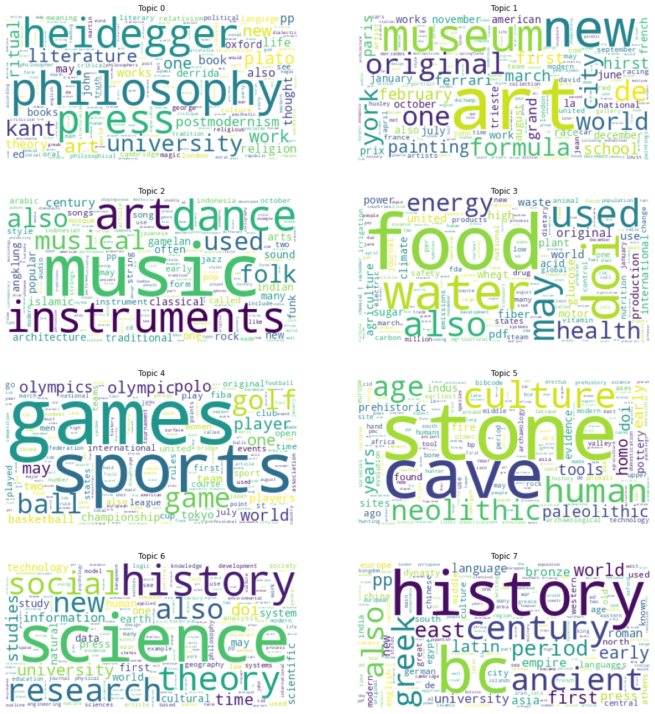

# Instrucciones para instalar

## Crear ambiente virtual

```bash
python3 -m venv venv

./venv/Scripts/activate

# instalar librerias dependiendo del sistema operativo
pip install -r requirements.linux.txt
pip install -r requirements.windows.txt
``` 

# Descripción
Se realizó un modelo para hacer topic modeling sobre artículos de wikipedia. Se entrenaron 28 modelos modificando hiperparámetros y se seleccionó el mejor modelo según la métrica dada por el coherence model con la data de validación.

## Extracción de la data
Para extraer los datos se reutilizó el proyecto de la tarea 2 utilizando Scrappy con la modificación para iniciar el scrapeo desde un tópico en específico. El código que utilizamos para extraer los datos se encuentra en un branch `tarea4` del repositorio de la tarea 2: https://github.com/EquipoAlfaBuenaMaravillaOndaDinamita/cmiads-tmnlp-h2/tree/tarea4

De esto se extrajeron artículos de cada una de las siguientes categorías:

TÓPICO|ARTÍCULOS
---|---
art|146
food|123
geography|141
history|68
music|135
science|91
sports|136
technology|138


## Data Split
```bash
jupyter notebook data_split.ipynb
```
Para iniciar con la preparación se decidió hacer un notebook únicamente para hacer el split de los dataset de train, test y validación. Este notebook toma el archivo `data/tokens_topics.csv` y lo separa aleatoriamente de la siguiente forma:
- `data/train.csv` con el 70% de los casos
- `data/test.csv` con el 15% de los casos
- `data/validation.csv` con el 15% de los casos


## Model train
```bash
jupyter notebook main.ipynb
```
Se definió una clase Model para entrenar el modelo de topic modeling. La clase posee un método fit para entrenar el modelo y un método predict para inferir los tópicos relacionados a un artículo. Se parametrizaron los siguientes hiperparámetros para buscar el mejor modelo:

- `steps`: un listado de pasos a ejecutar en el pipeline de entrenamiento e inferencia. Se puede colocar los siguientes valores:
    - `remove_stopwords`: elimina stopwords
    - `lemmatization`: lematiza utilizando un NLP model de spacy
    - `ngram`: calcula n-gramas utilizando gensim
- `nlp_model`: modelo de spacy a utilizar. Los valores válidos son:
    - `en_core_web_trf`
    - `en_core_web_lg`
    - `en_core_web_md`
    - `en_core_web_sm`
- `allowed_postags`: listado de postags disponibles para spacy. Tiene los tipos de palabras que utiliza el modelo de spacy para filtrar palabras. En la tabla abajo se muestran los valores posibles
- `ngrams`: valor de cantidad de n-gramas que se desea hacer. 2 calcularía bigramas, 3 trigramas, etc.
- `min_count` y `threshold`: parámetros para calcular ngrams 
- `topics`: cantidad de tópicos
- `alpha`: asimetría de los datos. Puede ser: auto o asymmetric
- `per_word_topics`: si es true el modelo le asigna un tópico a cada palabra
- `passes`: cantidad de pasadas sobre los textos


# Resultados

Se entrenaron 28 modelos buscando el de mejor coherencia sobre la data de validación. 

## Hiperparámetros del modelo seleccionado

El mejor modelo se obtuvo utilizando únicamente stopwords sin lematizar ni calcular ngrams. Se utilizaron 6 tópicos, alpha auto, per_word_topics true y 10 passes.

## Tópicos obtenidos en el mejor modelo

En el siguiente wordcloud se puede observar las palabras más recurrentes de cada tópico obtenido en el mejor modelo




## Clasificación de Tópicos

Del wordcloud anterior clasificamos los tópicos de la siguiente forma:

Tópico|Clasificación
--|--
0|Ciencia
1|Deportes
2|Historia y Cultura
3|Filosofia
4|Comida
5|Arte y Musica


## Sanity Check

Para cada categoría buscamos en la data de test artículos en los que fuera evidente la clasificación y se los pasamos al modelo. Con lo cual se obtuvo un resultado favorable.

Artículo|Tópico Real|Distribución
--|--|--
Formula One Racing|Sports|0.9127 en Deportes
Dynamics (music)|Music|0.8017 en Arte y Música
Science (disambiguation)|Science|0.7542 en Ciencia


# Contribuciones
Grupo 3 en canvas
- Kevin García: repositorio, jupyter de data_split, instalación y configuración de ambiente, modelo base con método de fit y parametrización de hiperparámetros
- Martín Guzmán: método predict, función para calcular métricas
- Entre los 2: definición de pruebas a realizar, ejecución, clasificación de tópicos y sanity check

