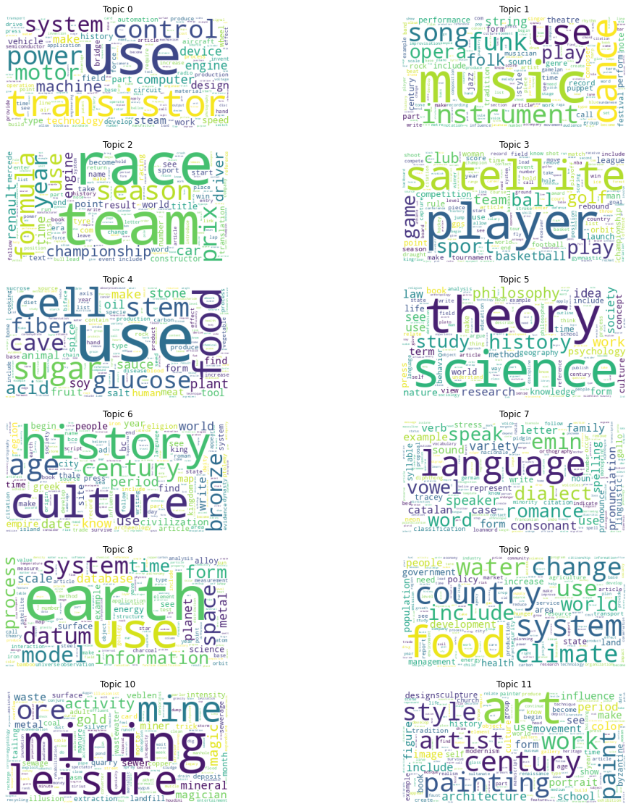

# Instrucciones para instalar

## Crear ambiente virtual

```bash
python3 -m venv venv

./venv/Scripts/activate

# instalar librerias dependiendo del sistema operativo
pip install -r requirements.linux.txt
pip install -r requirements.windows.txt
``` 

# Descripción
Se realizó un modelo para hacer topic modeling sobre artículos de wikipedia. Se entrenaron 28 modelos modificando hiperparámetros y se seleccionó el mejor modelo según la métrica dada por el coherence model con la data de validación.

## Extracción de la data
Para extraer los datos se reutilizó el proyecto de la tarea 2 utilizando Scrappy con la modificación para iniciar el scrapeo desde un tópico en específico. El código que utilizamos para extraer los datos se encuentra en un branch `tarea4` del repositorio de la tarea 2: https://github.com/EquipoAlfaBuenaMaravillaOndaDinamita/cmiads-tmnlp-h2/tree/tarea4

De esto se extrajeron artículos de cada una de las siguientes categorías:

TÓPICO|ARTÍCULOS
---|---
art|146
food|123
geography|141
history|68
music|135
science|91
sports|136
technology|138


## Data Split
```bash
jupyter notebook data_split.ipynb
```
Para iniciar con la preparación se decidió hacer un notebook únicamente para hacer el split de los dataset de train, test y validación. Este notebook toma el archivo `data/tokens_topics.csv` y lo separa aleatoriamente de la siguiente forma:
- `data/train.csv` con el 70% de los casos
- `data/test.csv` con el 15% de los casos
- `data/validation.csv` con el 15% de los casos


## Model train
```bash
jupyter notebook main.ipynb
```
Se definió una clase Model para entrenar el modelo de topic modeling. La clase posee un método fit para entrenar el modelo y un método predict para inferir los tópicos relacionados a un artículo. Se parametrizaron los siguientes hiperparámetros para buscar el mejor modelo:

- `steps`: un listado de pasos a ejecutar en el pipeline de entrenamiento e inferencia. Se puede colocar los siguientes valores:
    - `remove_stopwords`: elimina stopwords
    - `lemmatization`: lematiza utilizando un NLP model de spacy
    - `ngram`: calcula n-gramas utilizando gensim
- `nlp_model`: modelo de spacy a utilizar. Los valores válidos son:
    - `en_core_web_trf`
    - `en_core_web_lg`
    - `en_core_web_md`
    - `en_core_web_sm`
- `allowed_postags`: listado de postags disponibles para spacy. Tiene los tipos de palabras que utiliza el modelo de spacy para filtrar palabras. En la tabla abajo se muestran los valores posibles
- `ngrams`: valor de cantidad de n-gramas que se desea hacer. 2 calcularía bigramas, 3 trigramas, etc.
- `min_count` y `threshold`: parámetros para calcular ngrams 
- `topics`: cantidad de tópicos
- `alpha`: asimetría de los datos. Puede ser: auto o asymmetric
- `per_word_topics`: si es true el modelo le asigna un tópico a cada palabra
- `passes`: cantidad de pasadas sobre los textos


# Resultados

Se entrenaron 28 modelos buscando el de mejor coherencia sobre la data de validación. 

## Hiperparámetros del modelo seleccionado

El mejor modelo se obtuvo utilizando únicamente stopwords sin lematizar ni calcular ngrams. Se utilizaron 6 tópicos, alpha auto, per_word_topics true y 10 passes.

## Tópicos obtenidos en el mejor modelo

En el siguiente wordcloud se puede observar las palabras más recurrentes de cada tópico obtenido en el mejor modelo




## Clasificación de Tópicos

Del wordcloud anterior clasificamos los tópicos de la siguiente forma:

Tópico|Clasificación
--|--
0|Ingeniería
1|Música
2|Fórmula 1
3|Deportes
4|Comida y Salud
5|Ciencia
6|Historia y Cultura
7|Lenguaje
8|Planeta
9|Servicios Básicos
10|Minería
11|Arte


## Sanity Check

Para cada categoría buscamos en la data de test artículos en los que fuera evidente la clasificación y se los pasamos al modelo. Con lo cual se obtuvo un resultado favorable.

Artículo|Tópico Real|Distribución
--|--|--
Formula One Racing|Sports|0.8909 en Fórmula 1
Ball game|Sports|0.8028 en Deporte
Dynamics (music)|Music|0.7686 en Música
Science (disambiguation)|Science|0.7557 en Ciencia
Contemporary art|Art|0.7949 en Arte
Artificial general intelligence|Technology|0.64357 en Ciencia

## Análisis de Resultados

### Resultados obtenidos modificando los hiperparámetros del modelo. Los resultados se encuentran ordenados de forma descendente por coherence_validation
steps|ngrams|min_count|threshold|nlp_model|allowed_postags|topics|alpha|per_word_topics|passes|coherence_train|coherence_validation|train_min
--|--|--|--|--|--|--|--|--|--|--|--|--
[remove_stopwords, lemmatization]|NaN|NaN|NaN|en_core_web_sm|[NOUN, VERB]|12|asymmetric|False|10|0.586725|0.546080|4.628365
[remove_stopwords, lemmatization]|NaN|NaN|NaN|en_core_web_lg|[NOUN, VERB]|8|auto|True|40|0.561070|0.524534|1.086980
[remove_stopwords, lemmatization]|NaN|NaN|NaN|en_core_web_lg|[NOUN, VERB]|8|auto|False|10|0.557511|0.520509|0.284341
[remove_stopwords, lemmatization]|NaN|NaN|NaN|en_core_web_lg|[NOUN, VERB]|8|auto|True|10|0.557511|0.520509|4.921063
[lemmatization]|NaN|NaN|NaN|en_core_web_md|[NOUN, VERB]|8|auto|True|10|0.568655|0.519965|7.286702
[remove_stopwords]|NaN|NaN|NaN|None|None|6|asymmetric|True|50|0.537478|0.508774|2.633175
[remove_stopwords]|NaN|NaN|NaN|None|None|6|auto|True|30|0.530743|0.501648|2.059031
[remove_stopwords]|NaN|NaN|NaN|None|None|6|auto|True|50|0.530743|0.501648|2.515073
[remove_stopwords, lemmatization, ngram]|2.0|5.0|20.0|en_core_web_sm|[NOUN, VERB]|7|auto|True|20|0.499274|0.499662|4.921465
[remove_stopwords]|NaN|NaN|NaN|None|None|8|auto|True|10|0.545303|0.491841|0.808153
[remove_stopwords, lemmatization]|NaN|NaN|NaN|en_core_web_lg|[NOUN, VERB]|6|auto|True|10|0.519166|0.487696|0.258804
[remove_stopwords, lemmatization]|NaN|NaN|NaN|en_core_web_lg|[NOUN, VERB]|6|asymmetric|True|10|0.519166|0.487696|0.287550
[lemmatization]|NaN|NaN|NaN|en_core_web_sm|[NOUN, VERB]|8|auto|True|30|0.526597|0.482598|7.353234
[lemmatization]|NaN|NaN|NaN|en_core_web_lg|[NOUN, VERB]|7|asymmetric|False|100|0.514929|0.480660|2.732714
[lemmatization]|NaN|NaN|NaN|en_core_web_sm|[NOUN, VERB, ADJ, ADV, PART]|8|auto|True|40|0.474697|0.468948|8.022730
[lemmatization]|NaN|NaN|NaN|en_core_web_lg|[NOUN, VERB]|8|auto|True|10|0.498721|0.465620|7.404282
[lemmatization]|NaN|NaN|NaN|en_core_web_lg|[NOUN, VERB]|6|auto|True|20|0.492828|0.459613|0.523845
[remove_stopwords, lemmatization, ngram]|2.0|5.0|20.0|en_core_web_lg|[NOUN, VERB]|6|auto|True|20|0.474395|0.448287|5.181289
[remove_stopwords, lemmatization]|NaN|NaN|NaN|en_core_web_lg|[NOUN, VERB]|5|asymmetric|True|10|0.451864|0.433712|0.253604
[remove_stopwords, lemmatization]|NaN|NaN|NaN|en_core_web_lg|[NOUN, VERB]|4|auto|True|10|0.446590|0.431690|0.270162
[remove_stopwords, lemmatization, ngram]|3.0|5.0|20.0|en_core_web_lg|[NOUN, VERB]|5|asymmetric|True|20|0.452217|0.429713|5.277610
[remove_stopwords, lemmatization]|NaN|NaN|NaN|en_core_web_lg|[NOUN, VERB]|5|asymmetric|False|20|0.438584|0.423401|0.462886
[remove_stopwords]|NaN|NaN|NaN|None|None|4|asymmetric|False|20|0.412156|0.421416|0.940232
[remove_stopwords]|NaN|NaN|NaN|None|None|4|auto|True|50|0.402703|0.410204|2.144185
[lemmatization]|NaN|NaN|NaN|en_core_web_lg|[NOUN, VERB]|5|asymmetric|False|10|0.428078|0.408936|0.253451
[ngram]|2.0|10.0|30.0|None|None|6|auto|True|20|0.425571|NaN|1.585524
[ngram]|3.0|4.0|20.0|None|None|6|auto|True|20|0.368509|NaN|1.836605
[ngram]|3.0|4.0|20.0|None|None|6|auto|False|30|0.368017|NaN|1.754770

De la tabla de resumen de ejecución del modelo pudimos sacar las siguientes conclusiones:
- Se puede observar que la métrica de coherencia para los datos de entrenamiento vs validación vs prueba son bastante similares, por lo que se puede concluir que el modelo está generalizando bastante bien
- A diferencia de la tarea anterior de análisis de sentimiento, donde funcionaron mejor los modelos que únicamente lematizaban, para estos modelos se obtuvo mejor resultado al lematizar después de aplicar stopwords
- Calcular NGrams disminuye el performance de los modelos. Al igual que calcular modelos que utilizan solo NGrams en el pipeline de preprocesamiento, ya que fueron los de menor performance por mucho. 
- Scrapeamos información de 8 tópicos. Sin embargo, nos hizo sentido que el modelo que mejor coherencia nos entregó obtuviera 12 tópicos, ya que notamos que al extraer la información de wikipedia habían varios artículos que podían clasificarse en más de un tópico. Por ejemplo, notamos que separó todo lo relacionado a Fórmula 1 y el resto de deportes, lo cual hace bastante sentido.
- Para la lematización consideramos que nos funcionó bien el incluir únicamente NOUN y VERB como `alloweb_postags` (quitando ADV, ADJ y PART que consideramos que no agregaban valor a los temas)
- Se notó una relación de la coherencia con la cantidad de tópicos del modelo. A mayor cantidad de tópicos se obtuvo una mejor coherencia. Se puede observar que los modelos entrenados con 4, 5 y 6 tópicos por lo general tuvieron menor performance.
- La cantidad de `passes` también se correlacionó positivamente con la coherencia del modelo
- Nos vimos en la necesidad de extender las stopwords para limpiar algunos tokens que no quedaron del todo bien en el proceso de extracción de información de wikipedia. Ppalabras `isbn`, `pmid` o `retrieve` vimos que nos agregaban ruido en los wordclouds de los modelos, por lo que decidimos excluirlas en todos los entrenamientos
- En el sanity check podemos observar que en todos los casos clasificó bastante satisfactorio el artículo, por lo que consideramos que el modelo funcionó bastante bien con datos con los que no fue entrenado.

# Contribuciones
Grupo 3 en canvas
- Kevin García: repositorio, jupyter de data_split, instalación y configuración de ambiente, modelo base con método de fit y parametrización de hiperparámetros
- Martín Guzmán: método predict, función para calcular métricas
- Entre los 2: definición de pruebas a realizar, ejecución, clasificación de tópicos y sanity check
